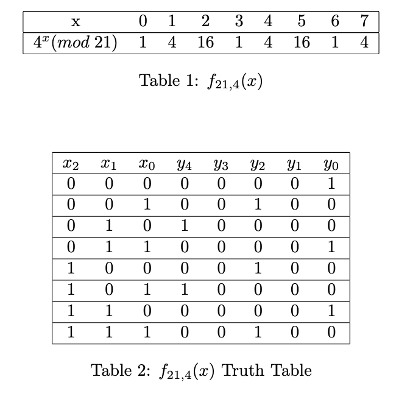
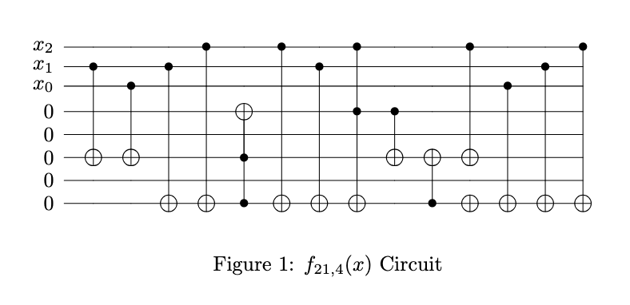

# Implementation

This was not my first exposure to Shor’s algorithm. However, there were
certainly components of this task which were firsts for me, such as implementing 
general modular exponentiation circuits, compiling to Clifford + T, and
implementing phase estimation for more than three qubits.

In order to approach these tasks, I did some preliminary research. This
led me to find the paper [GJ13] which gives some examples of modular exponentiation 
circuits for use in Shor’s algorithm. This paper builds these circuit
straightforwardly from truth tables, for small numbers of qubits. For example,
for the case where N = 21, we have an input register of three qubits and l = 4,
the truth table is:

The correspoding circuit is provided, in terms of Xs, CNOTs and Toffolis. As
an example to myself, I was easily able to implement this circuit using Xanadu’s
Pennylane.

Through this exercise it became clear to me that these circuits could be
synthesized from truth tables. Any linear transformation corresponding to such
a truth table can be solved for programmatically. This is akin to solving a linear
system of equations with binary variables.

Since there was a prize to be won for the most efficient circuit in terms
of T count, I thought there was reason to include an exhaustive search for
solutions besides the known Cuccaro ripple carry adder approach. To this end,
I wrote a function which would attempt to solve for in-place and then out-of-
place linear transformations by brute force which might(?) be more efficient
implementations of the modular exponentiation unitaries than the formulaic
ripple-carry adder approach which works in all cases but is not optimized for
any particular modular exponentiation circuit.

Some challenges arose as I wrote this part of the implementation. Namely,
Python’s Numpy can solve linear systems of equations with ‘linalg.solve‘, but
since the modular exponentiation functions’ truth tables yielded underdetermined systems, 
there were an infinite number of solutions and this approach
was not viable. Neither was ‘linalg.lstsq‘, which returns the least-squares solution, 
viable since even this solution was not possible to constrain to solve for
binary values only. Matlab has a function for solving linear systems of binary
variables, but Python does not.

Therefore, I wrote my own solution for solving for these linear transformations. 
This is inefficient, however the approach should be accurate. Hopefully,
using the approach in [PMH03] to then synthesize CNOT circuits from these
linear transformations efficiently offsets the inefficiency of solving for these transformations 
in the first place.

There were several challenges implementing the algorithm for efficient circuit
synthesis presented in [PMH03]. The pseudocode in the paper uses some language 
features which are not present in Python. For example, tensors (ranges
of values representing the patterns found in the sub-rows) are used as array indices. 
Tensors in Numpy are unhashable types. Therefore, I had to implement a
hashing function for these. I chose to convert the individual entries into strings
up to a certain precision and concatenate them.

I also had to translate the tuples which represent CNOTs in [PMH03] into
Pennylane circuits.

This is where two further considerations came into the picture. Instead
of simply converting each tuple (control, target) into a CNOT gate, I added
the appropriate extra control to make a Toffoli so that each entire modular
exponentiation circuit was controlled by the appropriate qubit in the input
register. Next, I compiled each Toffoli to Clifford + T using the compilation
specified in [WBS15].

When these methods failed, the default approach using the Cuccaro ripple
carry adder was used. The building of the Cuccaro adder was implemented
recursively, evaluating one addition in the sum $(((a_0^{2^i} b + a_1^{2^i} 2b) + a_2^{2^i} 2^2 b) + \dots + a_{n-1}^{2^i} 2^{n-1} b)$ per function call, where the scope of the evaluation in each stack
frame is denoted by the brackets. The value b was persisted in an ancilla register,
and the shifting was done by adding b to the most significant n − j bits of the
output register, where j is the subscript on the a2i
j and the amount of the shift.

Some challenges associated with this implementation were the need to have
the entire thing controlled by an input qubit and the sheer number of indices
to keep track of in the implementation. Of course, there was also the challenge
of needing to read multiple technical papers to understand this approach in the
first place.

To address the first of these challenges, Python’s partial function from the
functools library was used in various places to pre-initialize and re-package functions 
which built Pennylane circuits into functions which would take a controlling 
qubit index as a sole parameter and then implement the entire circuit with
an extra control on each CNOT, Toffoli, X, etc. This was to allow the control
of the entire modular multiplication unitary by an input qubit line. The challenges 
with keeping track of indices etc. was done by the use of careful naming
and commenting conventions. In particular, it was important to remember that
binary values were indexed from least to most significant bit in the Cuccaro
paper. Therefore, when iterating over binary values, it was sometimes necessary 
to reverse them to match what was in the corresponding qubit register. A
inal challenge was that the circuit ended up so large that Python’s max allowed
recursion depth needed to be extended in order to print it.

This approach yielded a very large circuit, and counting Ts by hand was
arduous. Therefore, I printed the circuit to a file and used grep to count the
occurences of the word “T”. This yielded 1548. Next was to count the number
of single qubit rotations and multiply it by $3 log_2 (1/ \epsilon)$. This yielded $1206 \times
3 log_2 (1 / 10^{−7})$. It adds up for a total of 85679 T gates.

My code was able to successfully factor 32 into 4 and 8. It was tried with
both the QFT and adjoint of QFT at the end of the circuit, which are both
valid since it is the period of the peaks in measurement outcome probability
which we care about. Getting the code to work required a lot of debugging and
problem solving. Debugging the circuit directly would be a difficult task since it
is so large, but it was easier to inspect and verify the function of the individual
parts such as the modular exponentiation unitaries. This was done prior to the
compilation to Clifford + T to make it easier. To this end, and to make our
work easier to grade, the circuit was generated with and without compilation
to Clifford + T.

# References

[GJ13] Omar Gamel and Daniel F. V. James. Simplified factoring algorithms
for validating small-scale quantum information processing technologies, 2013.

[PMH03] K. N. Patel, I. L. Markov, and J. P. Hayes. Efficient Synthesis of
Linear Reversible Circuits, February 2003. arXiv:quant-ph/0302002.

[WBS15] Jonathan Welch, Alex Bocharov, and Krysta M. Svore. Efficient Ap-
proximation of Diagonal Unitaries over the Clifford+T Basis, Novem-
ber 2015. arXiv:1412.5608 [quant-ph].
